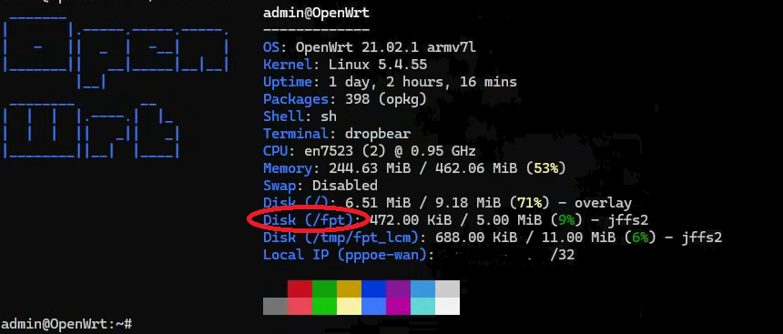
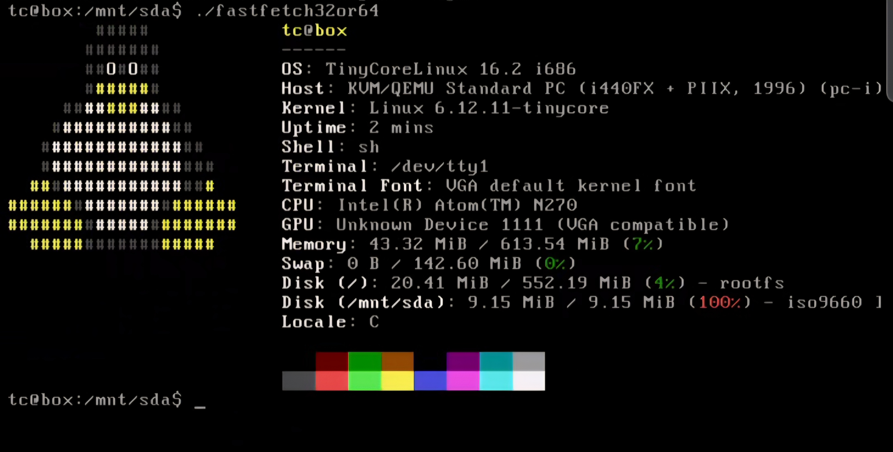

# fastfetch Pre-Compiled Builds

Pre-compiled [fastfetch](https://github.com/fastfetch-cli/fastfetch) binaries for weird Linux devices — TVs, routers, and anything else with a shell.

---

## Available Builds

| File | Target | Notes |
|---|---|---|
| `fastfetchARM32` | ARM 32-bit (with NEON) | most ARM devices: routers, TVs, set-top boxes |
| `fastfetchnoneon` | ARM 32-bit (no NEON) | older ARM CPUs without NEON — check with `cat /proc/cpuinfo` |
| `fastfetch32or64` | x86 / x86_64 | 32-bit binary, runs on both 32 and 64-bit x86 Linux |

> **Note:** Kernel 4.x+ recommended. Older kernels may cause a Segmentation fault.

---

## Quick Install (on the device)

### Easy way — if package manager works

```bash
sudo apt update && sudo apt install fastfetch && fastfetch
```

> Swap `apt` for your distro's package manager if needed. Use `neofetch` as a fallback if fastfetch won't install.

### Using curl

```bash
curl -Lo fastfetch https://raw.githubusercontent.com/wikiepeidia/fastfetch-precomplied-builds/main/builds/fastfetchARM32 && chmod +x fastfetch && ./fastfetch
```

```bash
curl -Lo fastfetch https://raw.githubusercontent.com/wikiepeidia/fastfetch-precomplied-builds/main/builds/fastfetchnoneon && chmod +x fastfetch && ./fastfetch
```

```bash
curl -Lo fastfetch https://raw.githubusercontent.com/wikiepeidia/fastfetch-precomplied-builds/main/builds/fastfetch32or64 && chmod +x fastfetch && ./fastfetch
```

### Using wget

```bash
wget -O fastfetch https://raw.githubusercontent.com/wikiepeidia/fastfetch-precomplied-builds/main/builds/fastfetchARM32 && chmod +x fastfetch && ./fastfetch
```

```bash
wget -O fastfetch https://raw.githubusercontent.com/wikiepeidia/fastfetch-precomplied-builds/main/builds/fastfetchnoneon && chmod +x fastfetch && ./fastfetch
```

```bash
wget -O fastfetch https://raw.githubusercontent.com/wikiepeidia/fastfetch-precomplied-builds/main/builds/fastfetch32or64 && chmod +x fastfetch && ./fastfetch
```

### Copy from your machine via SCP

```bash
scp builds/fastfetchARM32 user@device-ip:/path/to/destination/
```

---

## Running the Binary

```bash
chmod +x fastfetchARM32 && ./fastfetchARM32
```

```bash
chmod +x fastfetchnoneon && ./fastfetchnoneon
```

```bash
chmod +x fastfetch32or64 && ./fastfetch32or64
```

---

## Screenshots

### WebOS (LG TV)


### FPT Router



### x86 GDB Linux

\

### google collab


### alpine linux on browser


### tinycore linux on limbopc android



---

## Building From Source

Only needed if the pre-built binaries don't work for your device.

### Requirements

- Linux machine (VM, WSL, or bare metal)
- Internet access
- Terminal

### Step 1 — Install build tools

```bash
sudo apt install build-essential clang make git && sudo add-apt-repository universe && sudo apt update && sudo apt install gcc-arm-linux-gnueabihf g++-arm-linux-gnueabihf gcc-multilib g++-multilib
```

> Optional: install `apt-fast` to speed up downloads ~8x:
>
> ```bash
> sudo apt install aria2 && sudo add-apt-repository ppa:apt-fast/stable && sudo apt update && sudo apt install apt-fast
> ```
>
> Then replace `apt` with `apt-fast` in the command above.

### Step 2 — Clone fastfetch

```bash
git clone https://github.com/fastfetch-cli/fastfetch && cd fastfetch && mkdir -p build && cd build
```

### Step 3 — Build

#### ARM32 with NEON (most ARM devices)

```bash
cmake .. -DCMAKE_SYSTEM_NAME=Linux -DCMAKE_SYSTEM_PROCESSOR=arm -DCMAKE_C_COMPILER=arm-linux-gnueabihf-gcc -DCMAKE_CXX_COMPILER=arm-linux-gnueabihf-g++ -DCMAKE_C_FLAGS="-march=armv7-a -marm -mfpu=neon -mfloat-abi=hard" -DCMAKE_CXX_FLAGS="-march=armv7-a -marm -mfpu=neon -mfloat-abi=hard" -DCMAKE_EXE_LINKER_FLAGS="-static" -DENABLE_IMAGEMAGICK=OFF -DENABLE_RPM=OFF -DENABLE_SQLITE3=OFF -DENABLE_DBUS=OFF -DENABLE_DCONF=OFF -DENABLE_VULKAN=OFF -DENABLE_X11=OFF -DENABLE_WAYLAND=OFF -DENABLE_OPENCL=OFF -DENABLE_GLX=OFF -DENABLE_EGL=OFF -DENABLE_PULSE=OFF -DENABLE_DDCUTIL=OFF -DENABLE_DIRECTX_HEADERS=OFF -DENABLE_ELF=OFF -DENABLE_CHAFA=OFF && make -j$(nproc)
```

#### ARM32 without NEON (older/stripped ARM CPUs)

```bash
cd ~/somewhere/fastfetch && rm -rf CMakeFiles CMakeCache.txt && cmake . -DCMAKE_SYSTEM_NAME=Linux -DCMAKE_SYSTEM_PROCESSOR=arm -DCMAKE_C_COMPILER=/usr/bin/arm-linux-gnueabi-gcc -DCMAKE_CXX_COMPILER=/usr/bin/arm-linux-gnueabi-g++ -DCMAKE_C_FLAGS="-march=armv7-a -marm -mfpu=vfpv3-d16 -mfloat-abi=soft" -DCMAKE_CXX_FLAGS="-march=armv7-a -marm -mfpu=vfpv3-d16 -mfloat-abi=soft" -DCMAKE_EXE_LINKER_FLAGS="-static" -DENABLE_IMAGEMAGICK=OFF -DENABLE_RPM=OFF -DENABLE_SQLITE3=OFF -DENABLE_DBUS=OFF -DENABLE_DCONF=OFF -DENABLE_VULKAN=OFF -DENABLE_X11=OFF -DENABLE_WAYLAND=OFF -DENABLE_OPENCL=OFF -DENABLE_GLX=OFF -DENABLE_EGL=OFF -DENABLE_PULSE=OFF -DENABLE_DDCUTIL=OFF -DENABLE_DIRECTX_HEADERS=OFF -DENABLE_ELF=OFF -DENABLE_CHAFA=OFF && make -j$(nproc)
```

#### x86 / x86_64 (32-bit binary)

```bash
cmake .. -DCMAKE_SYSTEM_NAME=Linux -DCMAKE_SYSTEM_PROCESSOR=x86 -DCMAKE_C_COMPILER=gcc -DCMAKE_C_FLAGS="-m32" -DCMAKE_EXE_LINKER_FLAGS="-static" -DENABLE_IMAGEMAGICK=OFF -DENABLE_RPM=OFF -DENABLE_SQLITE3=OFF -DENABLE_DBUS=OFF -DENABLE_DCONF=OFF -DENABLE_VULKAN=OFF -DENABLE_X11=OFF -DENABLE_WAYLAND=OFF -DENABLE_OPENCL=OFF -DENABLE_GLX=OFF -DENABLE_EGL=OFF -DENABLE_PULSE=OFF -DENABLE_DDCUTIL=OFF -DENABLE_DIRECTX_HEADERS=OFF -DENABLE_ELF=OFF -DENABLE_CHAFA=OFF && make -j$(nproc)
```

---

## License

fastfetch is MIT licensed: <https://github.com/fastfetch-cli/fastfetch/blob/dev/LICENSE>
